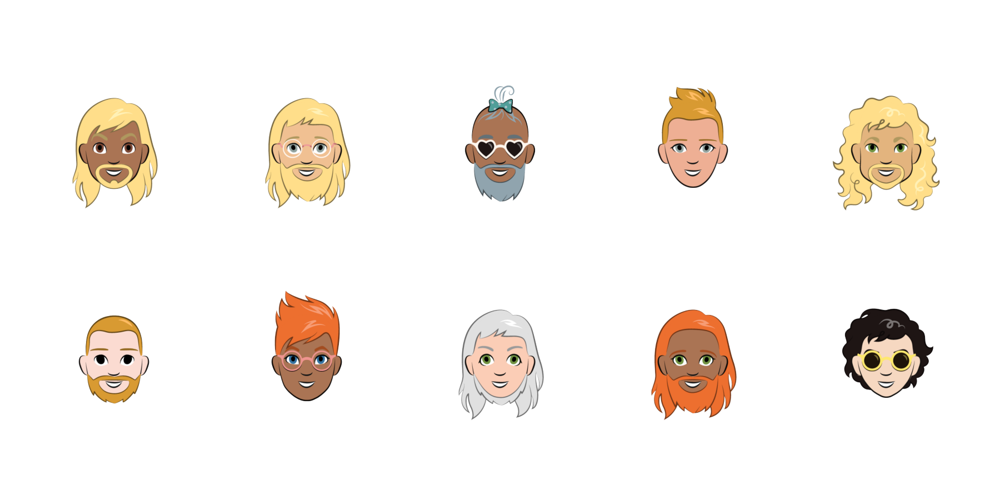

# Cartoon GAN
This is an attempt to create a GAN to produce Cartoon faces with [this dataset](https://google.github.io/cartoonset/) and following [this article](https://towardsdatascience.com/avatargan-generate-cartoon-images-using-gan-1ffe7d33cfbb).

Some sample images from the dataset are below

## Requirements
- tensorflow 2 & keras
- [Dataset](https://google.github.io/cartoonset/download.html)